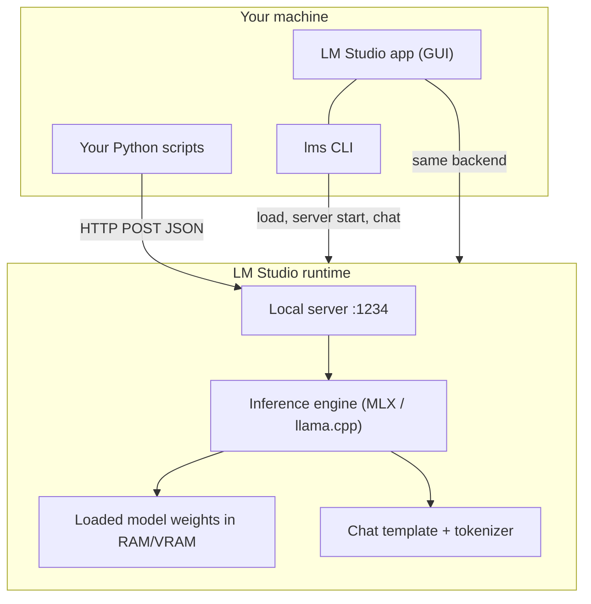
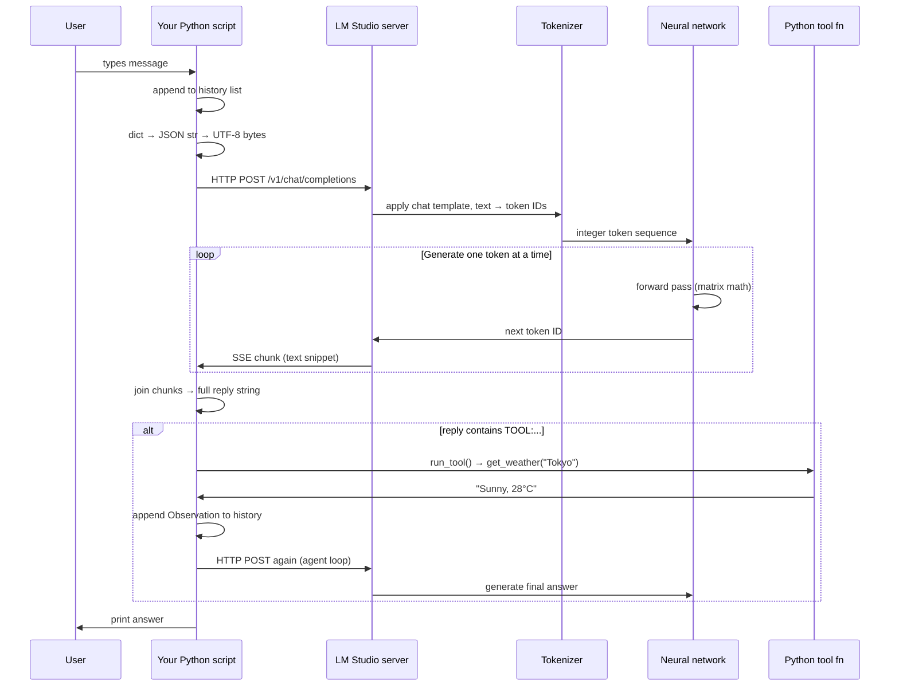

# LLM Agents — Course Outline

**Learn AI agent workflows from scratch by building them in plain Python.**

This document is the single source of truth for the course. Every lesson, concept, and milestone lives here. Work through the scripts in order.

| | |
|---|---|
| **Audience** | Developers new to LLMs and agents |
| **Stack** | Python stdlib + [LM Studio](https://lmstudio.ai/) (local inference) |
| **Philosophy** | No frameworks until you understand the loop underneath |
| **Format** | One concept per file → run → read → break → fix |

---

## Table of contents

1. [The big picture](#1-the-big-picture)
2. [Training vs inference](#2-training-vs-inference)
3. [How LM Studio works](#3-how-lm-studio-works)
4. [The interaction pipeline](#4-the-interaction-pipeline)
5. [Three layers that affect behavior](#5-three-layers-that-affect-behavior)
6. [Course roadmap](#6-course-roadmap)
7. [Lessons (syllabus)](#7-lessons-syllabus)
8. [Setup & daily workflow](#8-setup--daily-workflow)
9. [Glossary](#9-glossary)
10. [Design principles](#10-design-principles)
11. [Capstone project](#11-capstone-project)

---

## 1. The big picture

An **LLM** (Large Language Model) is a neural network trained to predict the next piece of text. An **agent** wraps that model in a loop so it can **act** — call functions, read files, search the web — not just chat.

This course moves you through four stages:

```
Chatbot          →  Streaming chat  →  Tool-using agent  →  Production agent
(01)                (02–03)             (04–06)              (07–17)
 "talk"              "remember"          "do things"          "do them reliably"
```

By the end you will understand the full path from **your keyboard** to **GPU inference** to **Python executing a tool** and back — without hiding any step behind a framework.

---

## 2. Training vs inference

These are two completely different phases. Everything in this course is **inference only**.

### Training (we do NOT do this)

Training is how a model *learns* — adjusting billions of weights using massive datasets and expensive GPU clusters over weeks or months.

| Aspect | Training |
|--------|----------|
| **Input** | Terabytes of text, code, conversations |
| **Process** | Forward pass → compute loss → backpropagation → update weights |
| **Output** | A model file (weights) — e.g. `gemma-4-12b-it-mlx` |
| **Who does it** | Google, Meta, OpenAI, Mistral — not you |
| **Cost** | Millions of dollars, thousands of GPUs |
| **Analogy** | Years of school — reading textbooks, taking exams |

The result of training is a **frozen brain**: it has knowledge and patterns baked in, but it does not learn from your chat in real time.

### Inference (everything we do)

Inference is *using* a trained model — feeding it a prompt and reading what it generates, one token at a time.

| Aspect | Inference |
|--------|-----------|
| **Input** | Your prompt (messages, system prompt, history) |
| **Process** | Tokenize → forward pass (no weight updates) → sample next token → repeat |
| **Output** | Generated text, streamed back to you |
| **Who does it** | LM Studio on your Mac, or a cloud API |
| **Cost** | Your electricity / API fees |
| **Analogy** | Taking an exam — the student applies what they already learned |

### Fine-tuning (mentioned, not covered)

A middle ground: take a pre-trained model and train it a little more on your specific data. Useful for custom tone or domain knowledge. Out of scope for this course, but worth knowing it exists between training and inference.

### Why this matters for agents

- The model **does not remember** your last conversation unless *you* send the history back (lesson `03`).
- The model **cannot run code** unless *your Python* executes it (lesson `04`).
- The model **cannot learn** from tool results permanently — it only sees them for the current request chain.
- When the model "decides" to call a tool, it is **predicting text** that looks like a tool call — not executing logic.

---

## 3. How LM Studio works

LM Studio is a **local inference runtime** — it loads model weights into memory and serves them via an API. It does not train models.

### Components



| Component | What it is | Example command |
|-----------|------------|-----------------|
| **LM Studio app** | GUI — browse models, chat in UI, start server | Open the app, click "Load Model" |
| **`lms` CLI** | Terminal control of the same backend | `lms load`, `lms server start` |
| **Loaded model** | Weights sitting in memory, ready to run | `lms ps` shows `gemma-4-12b-it-mlx` |
| **Local server** | OpenAI-compatible HTTP API on port 1234 | `lms server start` |
| **Inference engine** | Runs the math (MLX on Apple Silicon, etc.) | Hidden — LM Studio picks this |
| **Chat template** | Formats your messages with special tokens | Adds `<\|channel>`, role tags, etc. |
| **Tokenizer** | Text ↔ integer token IDs | Hidden — runs inside the engine |

### Common confusion

| State | Can you chat in the app? | Can `01_chat.py` work? |
|-------|--------------------------|------------------------|
| App open, nothing loaded | ❌ | ❌ |
| Model loaded, server **off** | ✅ (`lms chat` works) | ❌ Connection refused |
| Model loaded, server **on** | ✅ | ✅ |

**`lms chat` and your Python scripts are siblings** — both talk to the same loaded model, but `lms chat` uses the CLI path while your scripts use the HTTP API. Same brain, different door.

### What LM Studio does NOT do

- Train or fine-tune models
- Store conversation history between script runs (your code owns memory)
- Execute tools (your Python does that)
- Guarantee the model follows your `TOOL:...` format (that's prompt engineering + parsing)

---

## 4. The interaction pipeline

Every lesson in this course follows the same underlying pipeline. Know this cold.

### End-to-end flow



### Data shape at each step

| Step | Type | Example |
|------|------|---------|
| Your code | `dict` | `{"model": "...", "messages": [...]}` |
| On the wire (out) | `bytes` | `b'{"model": "gemma-4-12b-it-mlx", ...}'` |
| Inside server | token IDs | `[1234, 5678, 9012, ...]` (hidden from you) |
| On the wire (back) | `bytes` | `b'data: {"choices":[{"delta":{"content":"Hi"}}]}\n'` |
| Your code (parsed) | `str` | `"Hi"` → joined into `"Hi there!"` |
| Tool result | `str` | `"Sunny, 28°C in Tokyo"` → fed back as Observation |

**You never see token IDs** in this course. The API abstracts them into text. (Optional lesson `05_chat_stream_visualization.py` lets you inspect the bytes/str layers.)

### Chatbot vs agent pipeline

```
CHATBOT (01–03):
  User → history → LLM → reply → done

AGENT (04+):
  User → history → LLM → tool call? → Python runs fn → Observation → LLM → reply → done
                              ↑
                        inner while loop
```

---

## 5. Three layers that affect behavior

When something goes wrong — weird tags, ignored tools, hallucinated weather — check all three layers before blaming the model alone.

```
┌─────────────────────────────────────────────────────────────┐
│  ① Model                                                    │
│     Architecture, size, training data, instruction-tuning   │
│     → "Can it follow instructions? Does it know math?"      │
├─────────────────────────────────────────────────────────────┤
│  ② Runtime / app (LM Studio, Ollama, OpenAI…)              │
│     Chat template, tokenizer, API format, tool-call support │
│     → "Why did I get <|channel>thought before my tool call?"│
├─────────────────────────────────────────────────────────────┤
│  ③ Your code                                                │
│     System prompt, parsing, agent loop, error handling      │
│     → "Why didn't my regex match the tool call?"            │
└─────────────────────────────────────────────────────────────┘
```

| Layer | Controls | Real example from this course |
|-------|----------|-------------------------------|
| **Model** | Quality, reasoning, instruction-following | Gemma 4 tries to use tools but adds thinking-channel text |
| **Runtime** | Template, special tokens, API shape | LM Studio's Gemma template emits `<\|channel>thought` |
| **Your code** | Prompt design, parsing, loop logic | `re.fullmatch` failed → fixed with `re.search` |

**Key lesson:** The model's *intent* can be correct while the *format* is messy. Robust parsing is engineering, not prompting alone.

---

## 6. Course roadmap

```mermaid
flowchart LR
    subgraph P1["Phase 1 — LLM mechanics"]
        A1["01 chat"]
        A2["02 stream"]
        A3["03 conversation"]
    end
    subgraph P2["Phase 2 — Tools & agent loop"]
        B1["04 tools"]
        B2["05 multi-tool"]
        B3["06 structured output"]
    end
    subgraph P3["Phase 3 — Agent behaviors"]
        C1["07 errors"]
        C2["08 context"]
        C3["09 planning"]
        C4["10 file agent"]
        C5["11 web agent"]
        C6["12 sub-agents"]
    end
    subgraph P4["Phase 4 — Production"]
        D1["13 logging"]
        D2["14 human-in-loop"]
        D3["15 persistence"]
        D4["16 evaluation"]
        D5["17 capstone"]
    end
    P1 --> P2 --> P3 --> P4
```



| Phase | Theme | Outcome |
|-------|-------|---------|
| **1** | LLM mechanics | You understand HTTP, streaming, and memory |
| **2** | Tools & agent loop | You can build a tool-using agent in ~80 lines |
| **3** | Agent behaviors | Your agent handles errors, plans, and uses files |
| **4** | Production | Your agent is observable, persistent, and testable |

### Suggested pace (~1 hour/day)

| Week | Lessons | Goal |
|------|---------|------|
| 1 | `01`–`06` | Solid chat + tool agent |
| 2 | `07`–`10` | Reliable file agent |
| 3 | `11`–`15` | Production patterns |
| 4 | `16`–`17` + capstone | Ship the research assistant |

---

## 7. Lessons (syllabus)

> **How to use this section:** Complete lessons in order. Pass each checkpoint before moving on.

---

### Phase 1 — LLM mechanics

*Goal: understand what happens between `input()` and `print()` when you talk to a model.*

| File | Concepts | Checkpoint |
|------|----------|------------|
| `01_chat.py` | HTTP POST, JSON body, `messages` roles, `temperature`, reading `choices[0].message.content` | Explain the request body fields without looking at code |
| `02_stream.py` | `stream: true`, SSE format, `data: {json}`, `data: [DONE]`, printing tokens live | Describe why streaming feels faster even though total time is similar |
| `03_conversation.py` | `history` list, appending user/assistant messages, sending full history each call | Explain why the model "remembers" without any database |

**Phase 1 checkpoint:** Trace this path from memory: `dict` → `json.dumps` → `bytes` → HTTP → SSE chunks → `str` → print.

---

### Phase 2 — From chatbot to agent

*Goal: build the think → act → observe → repeat loop.*

| File | Concepts | Checkpoint |
|------|----------|------------|
| `04_tools.py` | Tool functions, `TOOLS` registry, system prompt contract, `TOOL:name:arg`, agent inner loop, `Observation`, defensive `re.search` | Explain who "decides" to call a tool (model vs Python) |
| `05_multi_tool.py` | Multiple tools, model chooses which one, `calculate`, `get_time` | Add a new tool yourself without help |
| `06_structured_output.py` | JSON-only responses, `json.loads`, retry on parse failure | Get reliable `{"city": "Tokyo"}` from a messy model |
| `06b_native_tools.py` | LM Studio `tools` API param, structured `tool_calls` response (optional) | Compare native vs prompt-based on the same task |

**The agent loop** (memorize this):

```python
while True:
    reply = stream_chat(history)
    history.append({"role": "assistant", "content": reply})
    result = run_tool(reply)
    if result is None:
        break                          # final answer
    history.append({"role": "user", "content": f"Observation: {result}"})
```

**Phase 2 checkpoint:** Build a working 2-tool agent from a blank file in under 30 minutes.

---

### Phase 3 — Real agent behaviors

*Goal: make agents useful and resilient, not just demo-ready.*

| File | Concepts | Checkpoint |
|------|----------|------------|
| `07_errors.py` | Tool exceptions → Observation, max retry count | Agent recovers when `get_weather("")` fails |
| `08_context.py` | Context window, token counting (rough), trim/summarize old turns | Agent still works after 30+ turns |
| `09_planning.py` | Plan-then-execute, step list before tool calls | "Research X and write a summary" → visible plan |
| `10_file_agent.py` | `read_file`, `list_dir`, `grep` tools | Answer questions about a local `.md` folder |
| `11_web_agent.py` | `fetch_url` tool, trust boundaries, timeouts | Summarize a public URL safely |
| `12_sub_agents.py` | Researcher + writer roles, manager orchestration | Two personas collaborate on one task |

**Phase 3 checkpoint:** File-search agent answers "What does notes/todo.md say about agents?" using only tools, no hallucination.

---

### Phase 4 — Production patterns

*Goal: ship something you'd trust beyond a demo.*

| File | Concepts | Checkpoint |
|------|----------|------------|
| `13_logging.py` | Log every LLM call, tool call, observation with timestamps | Reproduce a full agent trace from logs |
| `14_human_in_loop.py` | Confirm before destructive tools (write, delete) | Agent asks before writing a file |
| `15_persistence.py` | SQLite for history + state across runs | Resume a conversation after restart |
| `16_evaluation.py` | Test cases, pass/fail scoring | Run 5 prompts, report success rate |
| `17_capstone.py` | Full research assistant (see [Capstone](#11-capstone-project)) | Demo end-to-end to someone else |

**Optional finale:** Rebuild one lesson with LangGraph or OpenAI Agents SDK. You should recognize every step the framework automates.

---

### Appendix — optional deep dives

| File | Concepts |
|------|----------|
| `A1_chat_stream_visualization.py` | Inspect bytes vs str at each layer of the HTTP pipeline |

---

## 8. Setup & daily workflow

### First-time setup

```bash
# Install LM Studio from https://lmstudio.ai/
# CLI is included — verify:
lms --help

# Download and load a model
lms get gemma-4-12b-it-mlx    # or search in the app
lms load gemma-4-12b-it-mlx

# Start the API server
lms server start              # → http://localhost:1234

# Verify
curl http://localhost:1234/v1/models
```

### Every study session

```bash
lms server status             # 1. server running?
lms ps                        # 2. model loaded?
python3 0X_lesson.py          # 3. run today's lesson
```

### Useful `lms` commands

| Command | Purpose |
|---------|---------|
| `lms server start` | Start HTTP API on port 1234 |
| `lms server stop` | Stop the API |
| `lms server status` | Check if API is running |
| `lms load <model>` | Load model into memory |
| `lms ps` | List loaded models |
| `lms chat` | Terminal chat (bypasses your Python scripts) |
| `lms ls` | List downloaded models on disk |

---

## 9. Glossary

| Term | Definition |
|------|------------|
| **Token** | Smallest unit of text the model processes. Can be a word, subword, or symbol. API returns text; internally these are integers. |
| **Tokenization** | Converting text → token IDs (and back). Done by the runtime, not your code. |
| **Context window** | Max tokens the model can see in one request (prompt + history + reply). |
| **Temperature** | Randomness knob. `0` = deterministic, `1` = creative. |
| **System prompt** | First message setting behavior rules. Persists across the conversation. |
| **History / messages** | The full conversation sent every request. This *is* short-term memory. |
| **Streaming** | Tokens sent as SSE chunks instead of one big response. |
| **SSE** | Server-Sent Events — `data: {...}\n` lines over an open HTTP connection. |
| **Inference** | Running a trained model to generate output. All we do in this course. |
| **Training** | Creating/updating model weights from data. We do not do this. |
| **Chat template** | Runtime formatting that wraps messages with role tags and special tokens. |
| **Tool** | A Python function the LLM can request. Python executes it, not the model. |
| **Agent loop** | Inner `while` loop: LLM → maybe tool → observation → LLM again. |
| **Observation** | Tool result injected into history so the model can answer the user. |
| **Prompt-based tools** | Teach `TOOL:name:arg` in the system prompt; parse with regex. |
| **Native tool calling** | API returns structured `tool_calls` JSON — server handles parsing. |
| **Hallucination** | Model states something confidently that isn't true. Tools reduce this. |
| **RAG** | Retrieval-Augmented Generation — fetch relevant docs, then generate. A tool pattern; covered later. |

---

## 10. Design principles

1. **Stdlib first** — if you understand `urllib`, every SDK makes sense
2. **One concept per file** — each script adds exactly one new idea
3. **Local models** — forces honest prompt engineering and defensive parsing
4. **Parse defensively** — the model is probabilistic; your code is deterministic
5. **See the raw wire** — when confused, print `repr()` before you parse
6. **Build useful things early** — file agent by lesson 10, not lesson 50
7. **Frameworks last** — know what the loop does before something else owns it

### What we deliberately skip (until the end)

| Topic | Why wait |
|-------|----------|
| Vector DBs / RAG | Retrieval is just another tool — learn tools first |
| LangChain / CrewAI | Hides the loop you're here to understand |
| Cloud APIs | LM Studio teaches the same HTTP contract locally |
| Multi-agent swarms | Single-agent loop must be solid first |
| Training / fine-tuning | Inference-only course; different discipline entirely |

---

## 11. Capstone project

**Build a research assistant agent** (`17_capstone.py`).

### Requirements

1. User asks a research question
2. Agent plans steps (visible in logs)
3. Searches a local folder of `.md` files with `grep` or text search
4. Reads relevant files
5. Writes a summary to `output.md`
6. Logs every LLM call, tool call, and observation

### Skills used

```
03_conversation  →  memory
04_tools         →  tool loop
07_errors        →  resilience
09_planning      →  step breakdown
10_file_agent    →  file tools
13_logging       →  observability
```

### Success criteria

- [ ] Answers from file content, not hallucination
- [ ] Handles missing files gracefully
- [ ] Produces a readable `output.md`
- [ ] Full trace in logs for debugging
- [ ] Demo-able in under 5 minutes
