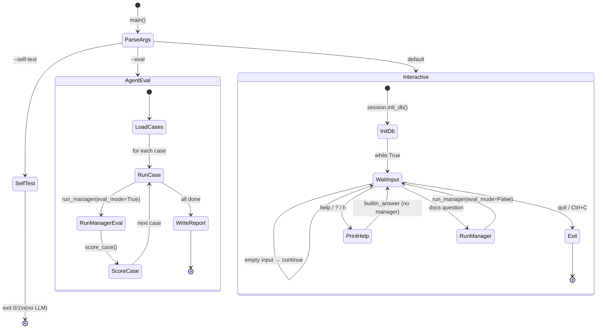
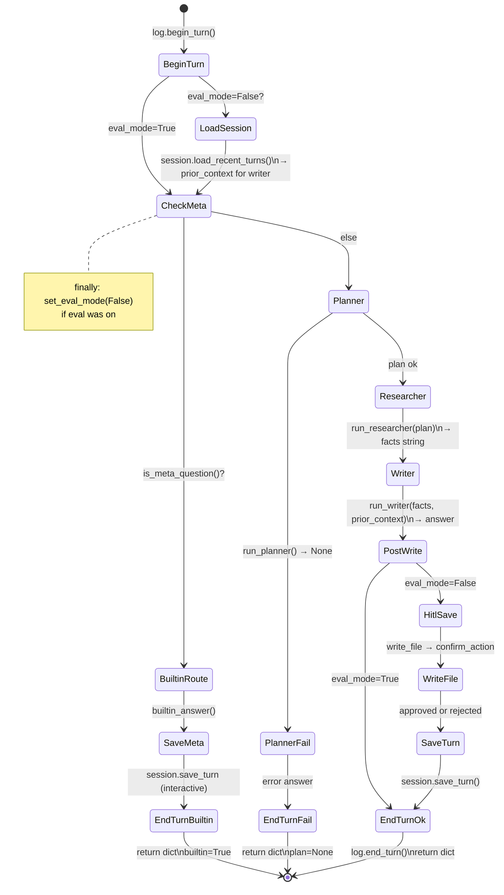
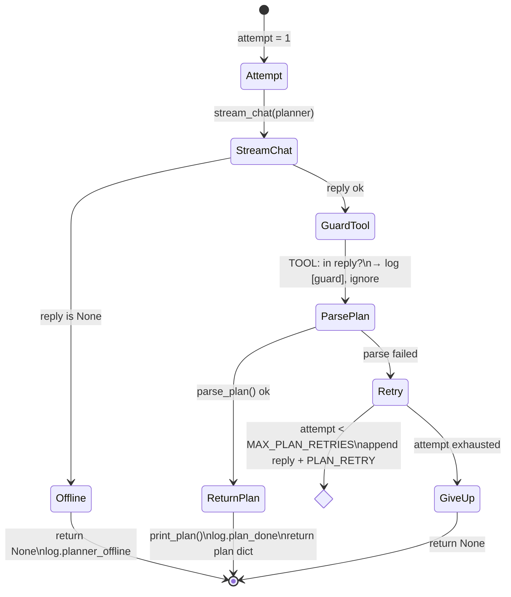
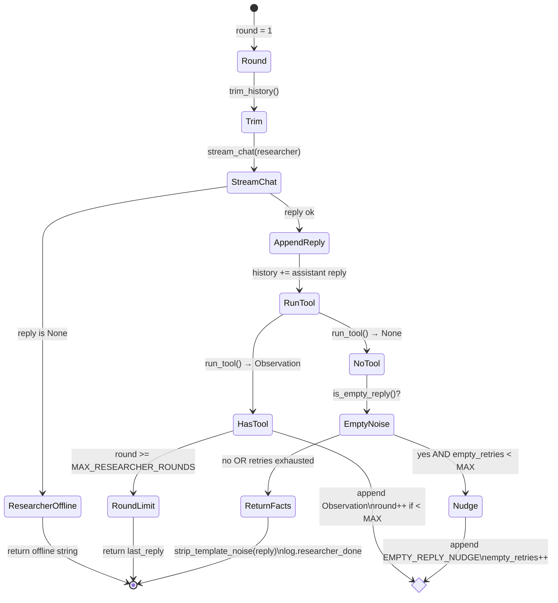
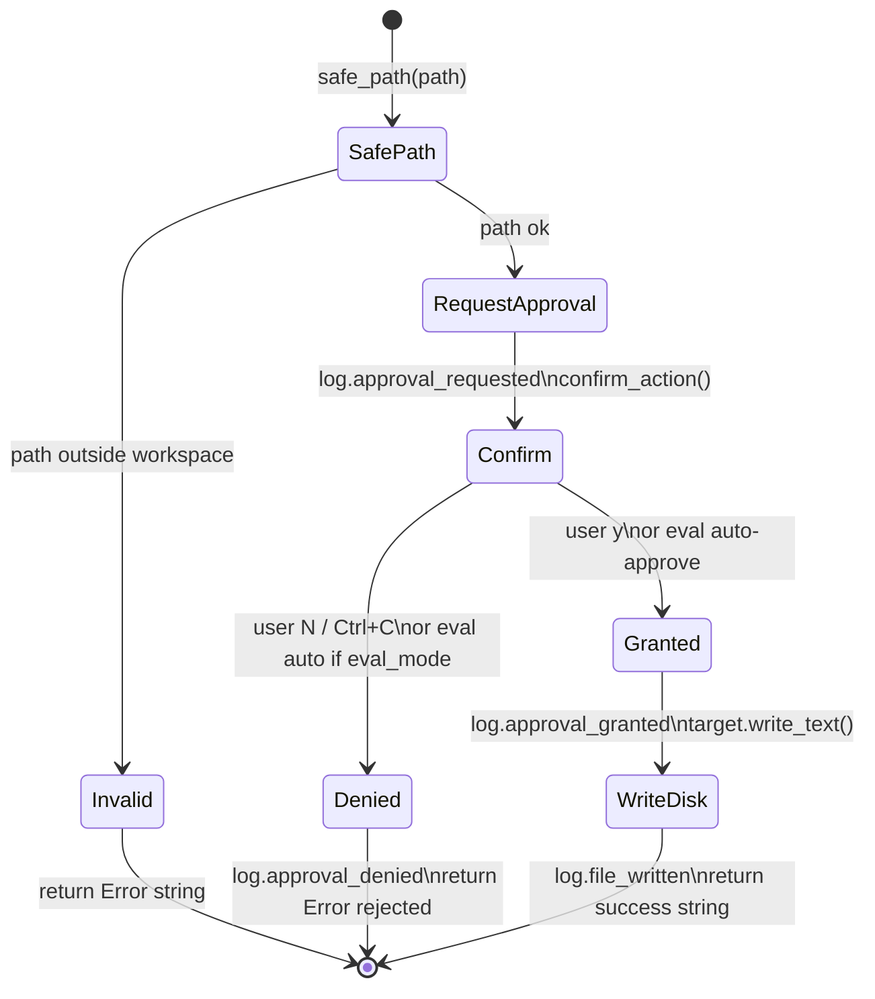

# Lesson 17 — Internal Docs Q&A (capstone)

Combine everything from lessons 09–16 into one agent that answers questions about your company's internal documentation.

## What this teaches

This is not a new concept — it is the **full workflow** wired together:

```
User question
  → run_manager()          [Python orchestration — lesson 12]
  → run_planner()          [JSON plan, no tools — lesson 09]
  → run_researcher()       [file + web tools — lessons 10 + 11]
  → run_writer()           [cited answer — lesson 12]
  → HITL write_file()      [human approval — lesson 14]
  → session save           [SQLite memory — lesson 15]
  → JSONL logs             [evidence — lesson 13]
  → eval scoring           [pass/fail — lesson 16]
```

The **model never chooses sub-agents**. Python runs a fixed pipeline; each sub-agent is an LLM call with its own system prompt and tool loop.

## Prerequisites

- LM Studio running with a model loaded (`lms server start`, `lms load gemma-4-12b-it-mlx`)
- Lessons 09–16 completed (or skimmed)

## Run

```bash
# Interactive Q&A (HITL + persistence enabled)
python3 section_2/17_capstone/17_capstone.py

# Scorer self-test — no model needed
python3 section_2/17_capstone/17_capstone.py --self-test

# Full agent eval — needs LM Studio
python3 section_2/17_capstone/17_capstone.py --eval
```

## Try these questions

**Overview & navigation**
- "Give me an overview of our internal documentation"
- "What docs exist and what is each one for?"

**Single-doc lookup**
- "What is the refund window in our policy?"
- "How do I authenticate to the internal API?"

**Procedures**
- "Walk me through a staging deploy"
- "What are the production deploy rules?"

**Cross-doc synthesis** (reads multiple files — richer answers)
- "I'm a new engineer — what must I read before prod deploy?"
- "A customer wants a refund — what do I check?"
- "Compare staging vs production API rate limits"

**Follow-ups** (uses SQLite session memory)
- First: "What are the prod deploy rules?"
- Then: "What about Fridays?"

**Meta** (Python only — no LLM, type `help`)
- "What tools do you have?"
- "What can you help with?"

## Folder layout

```
17_capstone/
  17_capstone.py       # entry: interactive / --eval / --self-test
  sub_agents.py        # planner + researcher + writer + run_manager
  agent_log.py         # JSONL evidence
  human_confirm.py     # HITL gate for writes
  session_store.py     # SQLite chat memory
  eval_scoring.py      # deterministic pass/fail
  test_cases.json      # docs Q&A eval cases
  workspace/docs/      # fake internal docs (sandbox)
  output/              # saved answers (after HITL approval)
  logs/agent.jsonl     # run evidence
  data/session.db      # persisted turns
```

## What to watch in the terminal

0. `[manager] builtin route` — help/meta answered by Python, not the model
1. `[planner]` — JSON plan printed before any `[researcher] tool` lines
2. `[guard]` — if the model tries `TOOL:` during planning, Python blocks it
3. `[researcher] tool read_file(...)` — facts grounded in `workspace/docs/`
4. `[writer]` — final answer with doc citations
5. HITL prompt — approve or deny saving to `output/answer.md`
6. `[session] saved turn #N` — SQLite persistence across restarts

## Production path (conceptual)

| Local dev (this lesson) | Production |
|-------------------------|------------|
| `workspace/docs/` | S3 / Notion / Confluence |
| LM Studio localhost | OpenAI / Anthropic API on a VPS |
| `input()` HITL | Slack approval button |
| SQLite session | Postgres + user IDs |
| JSONL logs | Datadog / structured logging |
| `test_cases.json` | CI eval on every deploy |

You built the harness in plain Python. Frameworks (LangChain, etc.) are optional wrappers around the same loop.

## Break it on purpose

1. Ask about a doc that doesn't exist — researcher should return an error observation and recover
2. Deny the HITL write — answer still shown, nothing saved to `output/`
3. Restart the script and ask a follow-up — writer gets prior turns from SQLite
4. Run `--eval` and inspect `reports/eval_report.json` for failures

## Control flow diagrams

Every branch below maps to real code in `17_capstone.py` and `sub_agents.py`. Follow one question in the terminal and tick off states as they happen.

### Entry point — `main()` and interactive loop



### Manager — `run_manager()` (one user question)



### Planner — `run_planner()` (retry loop, no tools)



### Researcher — `run_researcher()` (agent inner loop)



### Write path — `write_file()` + HITL



### How the three loops nest

```
OUTER   17_capstone.py:  while True: input → run_manager
MIDDLE  run_manager:     plan → research → write → save
INNER   run_researcher:  while rounds: LLM → tool → Observation
INNER   run_planner:     for attempts: LLM → parse JSON → retry
        run_writer:      single LLM call (no inner loop)
```

Match terminal prefixes to states: `[manager]` = middle loop, `[planner]` / `[researcher]` / `[writer]` = sub-agent states, `[hitl]` = write gate.
